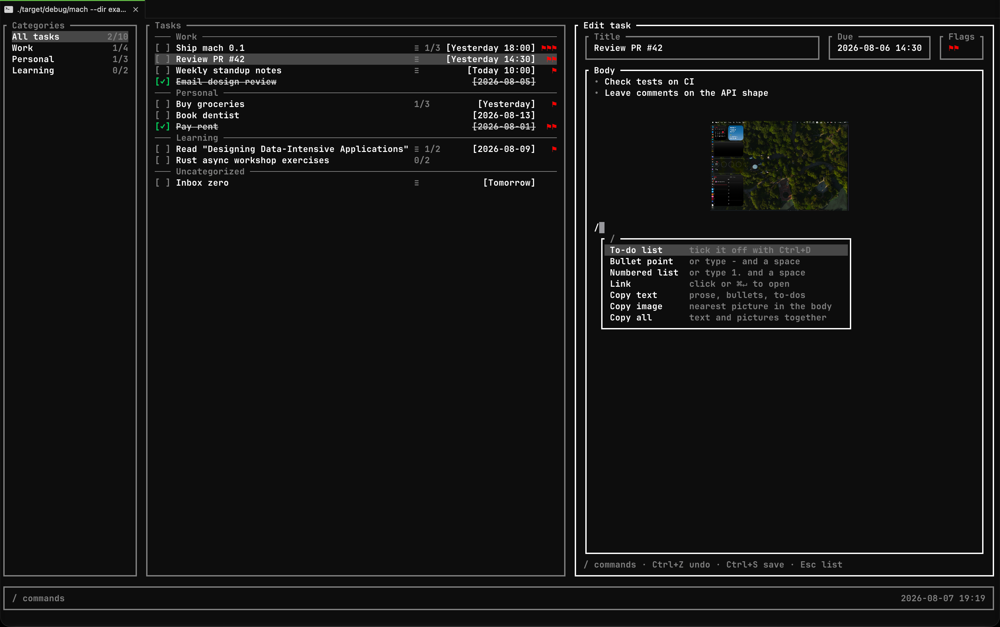
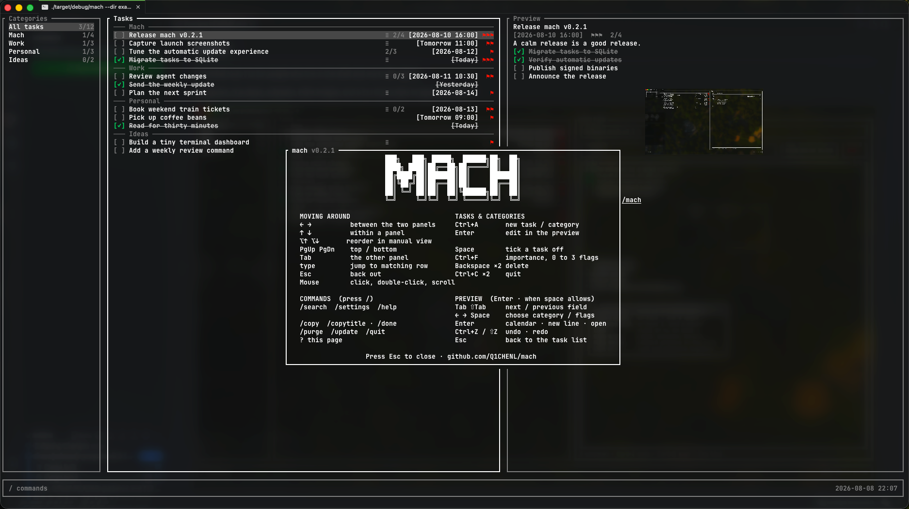

# Mach

A terminal-first task manager for people who live in the shell and work with agents.

Categories, due dates, subtasks, inline images, and a CLI that scripts or
agents can drive.





## Install

```sh
# 1. checksum-verified release binary → ~/.local/bin
curl -fsSL https://raw.githubusercontent.com/Q1CHENL/mach/main/install.sh | sh

# 2. crates.io → ~/.cargo/bin  (Rust 1.90+)
cargo install --locked mach-tui

# 3. local clone
git clone https://github.com/Q1CHENL/mach.git && cd mach && cargo install --locked --path .
```

Crate name **`mach-tui`**, binary **`mach`**.

## CLI

`mach` with no args opens the TUI. Subcommands cover add / list / edit /
done / delete / categories / subtasks and more, with flags for due dates,
importance, category, description markup, and `--json` for scripts.

```sh
mach --help
```

Agents work well against the same CLI — stable flags, unique ID prefixes,
and JSON output when you need it.

Export every task, category and referenced image to one portable archive, then
safely merge it into another mach data directory:

```sh
mach export tasks.mach
mach --dir ~/restored-mach import tasks.mach
```

The TUI uses `/export` to create a timestamped `.mach` archive in the current
directory and `/import <FILE>` to restore a specified archive. The CLI also
accepts `mach export [FILE]`; without a file it uses the current directory.
Export never overwrites an existing file.
Re-importing identical records is a no-op. An ID, category-name or attachment
metadata conflict aborts the whole merge before tasks, categories or attachment
records change.

The TUI checks in the background, including while it stays open. A successful
check schedules the next one 24 hours later. Failed checks retry after an hour
by default and honor server-provided backoff. Run `/update` to download,
verify its SHA-256 checksum, and install the latest release, or use
`mach update --install` from the shell. Self-update follows release-installer
ownership: it updates `~/.local/bin/mach` or a custom destination previously
recorded by the release installer. Cargo and other package-manager installs
must be updated through their manager; set `MACH_INSTALL_DIR` only when you
intentionally want to replace one with a release binary.

## Data

Lives in **`~/.mach`**: tasks and settings in SQLite (`mach.db`), with managed
images under `images/`. The CLI and TUI safely share the same store, and changes
appear in the running app.

Existing JSON data is imported automatically on first launch and left
untouched. Back up the whole directory while mach is closed.

Portable `.mach` archives contain versioned JSON data plus the exact managed
image bytes referenced by those tasks. Import verifies the archive structure,
image format, size and SHA-256 before committing. App preferences and the
separate update schedule are not part of a task archive.

Another folder: `--dir PATH` or `MACH_DIR`.

Update scheduling and discovered releases are shared separately in
`~/.mach/update.db`, so changing the task data directory does not duplicate or
suppress application updates.

## License

[MIT](LICENSE)
